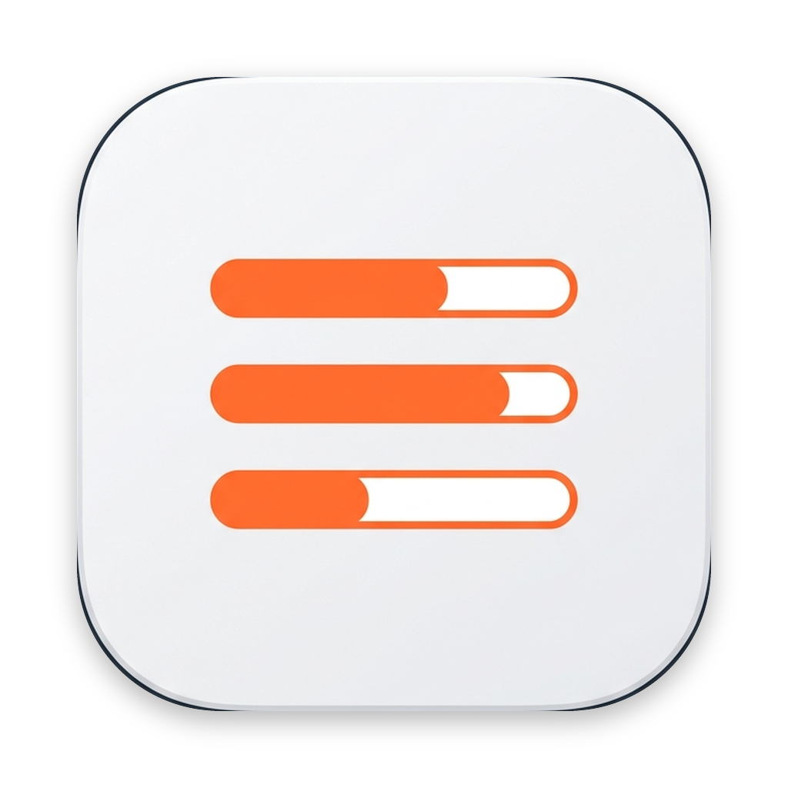
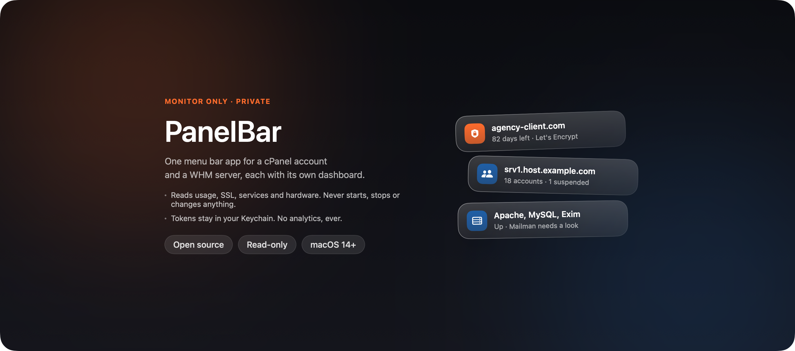

<p align="center">
  
</p>

<h1 align="center">PanelBar</h1>

<p align="center">
  One menu bar app for a cPanel account and a WHM server, each with its own dashboard.<br />
  A small, native, read-only macOS app for people who manage hosting.
</p>

<p align="center">
  
  
  
</p>

<p align="center">
  
</p>

PanelBar is an unofficial community tool and is not affiliated with cPanel, L.L.C. or WebPros.

It replaces the habit of signing into cPanel or WHM just to check whether something needs attention: one click shows disk usage, SSL expiry, service health and account status, with its own dashboard for each kind of connection.

## Features

**See**
- A menu bar item with a status dot and one stat of your choice: disk/accounts, SSL days left/services, or just the icon. Green is online, amber needs a token or has something to look at, gray is offline.
- A **cPanel account** dashboard: quota, domains with SSL status, and account details.
- A **WHM server** dashboard: hosted accounts, system load, disk usage and service health, plus hostname and version.
- Both dashboards open with a hero stat, an inline server switcher and an "Open cPanel/WHM ↗" shortcut, so a login is one click away when you actually need it.

**Inspect**
- cPanel: every domain's SSL certificate, sorted worst-first, with days-left and issuer.
- WHM: hosted accounts sorted by disk usage, with suspension reason and quota; services sorted so anything down surfaces first.
- A clear, specific error when a certificate doesn't match the hostname you connected with — the common case on shared or reseller hosting — instead of a generic TLS failure.

**Connect**
- Save several accounts and servers, cPanel and WHM together, and switch between them from the header.
- API tokens are stored in the macOS Keychain, never in UserDefaults.
- Test connection checks the token against a real read call, not just that the host is reachable, so a rejected token is reported instead of looking healthy.
- Remote `http://` servers are refused unless you allow insecure HTTP for that one connection. See [Connecting to a remote server](#connecting-to-a-remote-server).
- Optional Touch ID to edit or delete a saved connection.

**Stay out of the way**
- Read-only. PanelBar sends only `GET`-equivalent requests and never starts, stops or changes anything in cPanel or WHM.
- Refreshes on a schedule you choose.
- No analytics and no third-party dependencies. It talks only to the accounts and servers you add.
- Follows the system light and dark appearance, and the system language — with manual overrides for both. Interface strings are available in English, Simplified Chinese, Japanese, German, Spanish, French and Turkish.

## Install

### Download

Get the latest `PanelBar-<version>.dmg` from [Releases](https://github.com/fr3on/panelbar/releases), open it and drag PanelBar to Applications. Then follow [Opening an unsigned build](#opening-an-unsigned-build) the first time.

### Build from source

Needs macOS 14+ and a Swift 6 toolchain (Xcode or the Command Line Tools).

```bash
git clone https://github.com/fr3on/panelbar.git
cd panelbar
./scripts/build-app.sh      # builds build/PanelBar.app (universal: Apple silicon + Intel)
open build/PanelBar.app
```

PanelBar has no Dock icon. Look for it in the menu bar. The first launch opens a short setup that connects your first account or server.

### Opening an unsigned build

The app is ad-hoc signed, not notarized, so macOS blocks a copy that was downloaded or copied from another machine. To allow it, open **System Settings > Privacy & Security** and click **Open Anyway**, or remove the quarantine flag:

```bash
xattr -dr com.apple.quarantine /path/to/PanelBar.app
```

A build you make yourself runs without a warning.

## Connecting to a remote server

Use `https://` when you can. macOS blocks unencrypted `http://` to remote hosts, and PanelBar enforces the same rule itself:

- **HTTPS.** cPanel and WHM serve their APIs over TLS by default (ports 2083/2087) — this is the common case and needs no extra setup.
- **SSH tunnel.** Forward the port and point PanelBar at `http://localhost:2087` (or `2083`):
  ```bash
  ssh -N -L 2087:localhost:2087 user@your-server
  ```
- **Allow insecure HTTP.** For a network you trust, such as a LAN or VPN, switch on **Allow insecure HTTP for this server** when adding it. The API token and data are then sent unencrypted. A connection that allows this shows an open-lock icon in the popover.

A `localhost` address never needs the switch.

A certificate that doesn't match the hostname you connected with — common on shared or reseller hosting — isn't a reason to fall back to plain HTTP: PanelBar reports the mismatch directly and the fix is usually to connect using the hostname shown on the certificate instead.

## Settings

Open the gear menu in the popover and choose **Settings**. Changes save instantly.

- **Accounts and Servers:** manage every saved connection, edit or delete one, and add another.
- **General:** Launch at login, Appearance (System, Light or Dark), and Language.
- **Menu Bar:** what to show next to the icon, and whether to show only the icon and dot while offline.
- **Refresh:** how often the popover refreshes while open, and how often the menu bar item checks in the background.
- **Security:** require Touch ID to edit or delete a saved connection.
- **Privacy, About:** what PanelBar does and doesn't do, and the version, with a manual update check.

## What it reads

Every request is a read-only call to an account or server you added. Nothing else is contacted.

| Call | Used for |
| :--- | :--- |
| `Quota::get_quota_info` (cPanel UAPI) | Disk quota |
| `DomainInfo::domains_data` (cPanel UAPI) | Domains, subdomains, parked/addon domains |
| `SSL::list_certs` (cPanel UAPI) | Certificate issuer and expiry per domain |
| `listaccts` (WHM API 1) | Hosted accounts, disk limits, suspension state |
| `servicestatus` (WHM API 1) | Service health |
| `systemloadavg` (WHM API 1) | 1/5/15-minute load average |
| `get_disk_usage` (WHM API 1) | Per-account disk and inode usage |
| `gethostname`, `version` (WHM API 1) | Server hostname and WHM version |

The API token is sent as the `Authorization` header (`cpanel user:token` or `whm user:token`).

## Safety and privacy

- **Read-only.** There is no button that changes state. Renewals, suspensions and service changes stay in cPanel and WHM, one click away.
- **Encrypted or opted in.** A remote `http://` request is refused before anything, including the API token, is sent, unless that connection allows it.
- **Keychain only.** API tokens never touch UserDefaults or disk.
- **No telemetry.** PanelBar collects nothing and makes no network requests except to the accounts and servers you add.

See [SECURITY.md](SECURITY.md) to report a problem.

## Development

```bash
swift build          # compile
swift test            # run the tests
./scripts/build-app.sh   # package build/PanelBar.app
```

```
Sources/
  PanelBarCore/    REST clients (UAPI + WHM API 1), models, connection policy, settings, Keychain. No UI imports.
  PanelBar/        SwiftUI app: menu bar item, popover, screens, design system.
Tests/             Swift Testing suites. cPanel/WHM responses live in Fixtures/, transcribed from real API output.
scripts/           build-app
assets/            App icon
```

- **Screens from the real views.** A debug build can render the app's own views with fixture data to a PNG: `.build/debug/PanelBar --snapshot /tmp/screens.png`. It never touches the network, the Keychain or your saved connections.

Contributions are welcome. Read [CONTRIBUTING.md](CONTRIBUTING.md) first, and follow the [Code of Conduct](CODE_OF_CONDUCT.md).

## License

[MIT](LICENSE)
